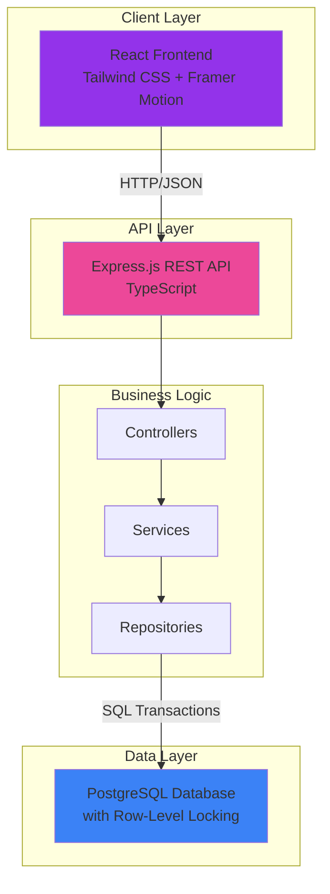
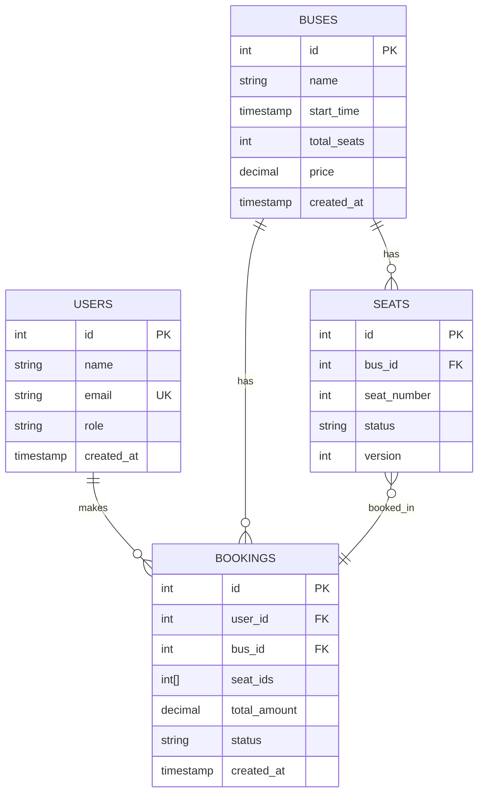

# Bus Ticket Booking System - System Design

## Overview
This document outlines the high-level architecture and design decisions for the Bus Ticket Booking System, a production-grade application built to handle high-concurrency scenarios.

---

## Architecture Diagram



---

## Database Schema

### Entity-Relationship Diagram



### Table Definitions

**users**: Stores user information (admin/user roles)  
**buses**: Bus trips with name, start time, seat capacity  
**seats**: Individual seats linked to buses (status: AVAILABLE, BOOKED, LOCKED)  
**bookings**: Transaction records with seat IDs array

---

## Concurrency Strategy

### The Problem
When two users try to book the same last seat simultaneously, without proper concurrency control, both could succeed, leading to overbooking.

### The Solution: Pessimistic Locking

We use **PostgreSQL row-level locking** with `SELECT ... FOR UPDATE`:

```typescript
// Inside a database transaction
BEGIN;

// 1. Lock the specific seat rows (prevents other transactions from reading/modifying)
SELECT id, seat_number, status 
FROM seats 
WHERE id = ANY($1::int[]) 
FOR UPDATE;

// 2. Validate seat availability
if (seat.status !== 'AVAILABLE') {
    ROLLBACK;
    throw Error('Seat not available');
}

// 3. Update seat status
UPDATE seats SET status = 'BOOKED' WHERE id = ANY($1::int[]);

// 4. Create booking record
INSERT INTO bookings (...) VALUES (...);

COMMIT;
```

### Why This Works

1. **`FOR UPDATE` Clause**: Acquires an exclusive lock on the selected rows
2. **Transaction Isolation**: Other transactions attempting to lock the same rows will **wait** until this transaction commits/rollbacks
3. **ACID Guarantees**: PostgreSQL ensures atomicity - either all steps succeed or all fail
4. **Deadlock Prevention**: We sort seat IDs before locking to ensure consistent lock ordering

### Alternative Approaches Considered

❌ **Optimistic Locking** (version field): Prone to retry storms under high load  
❌ **Application-Level Mutex**: Doesn't work in distributed systems  
✅ **Pessimistic Locking**: Best for high-contention scenarios like ticket booking

---

## Scalability Plan

### Current Architecture (MVP)
- Single Express server
- Single PostgreSQL instance
- Stateless API (can scale horizontally)

### Production Scaling Strategy

#### 1. Database Scaling

**Read Replicas**  
- Master for writes (bookings, bus creation)
- Replicas for reads (listing buses, fetching seat availability)
- Reduces load on primary database

**Sharding**  
- Shard by `bus_id` or geographic region
- Example: North region buses → DB1, South → DB2

**Connection Pooling**  
- Already using `pg.Pool` (currently 10 connections)
- Production: Increase pool size based on load testing

#### 2. Caching Layer (Redis)

```
Cache frequently accessed data:
- Bus listings (TTL: 5 minutes)
- Seat availability aggregates (invalidate on booking)

Cache Strategy:
- Cache-aside pattern for reads
- Write-through cache for bookings (update cache after DB commit)
```

#### 3. Load Balancing

```
                    ┌─────────────┐
                    │   Nginx     │
                    │ Load Balancer│
                    └─────────────┘
                           │
        ┌──────────────────┼──────────────────┐
        │                  │                  │
   ┌────▼────┐       ┌────▼────┐       ┌────▼────┐
   │  API-1  │       │  API-2  │       │  API-3  │
   └─────────┘       └─────────┘       └─────────┘
```

- Distribute traffic across multiple Express instances
- Nginx with round-robin or least-connections

#### 4. Message Queue (Optional Enhancement)

For **booking confirmation emails** or **payment processing**:

```
[API] → [Booking DB] → [Publish to RabbitMQ/SQS] → [Worker Processes]
```

Benefits:
- Decouple non-critical operations
- Retry failed email/payment jobs
- Better fault tolerance

#### 5. CDN for Frontend
- Serve React build from Cloudflare/AWS CloudFront
- Reduce latency for global users

---

## Security Considerations

1. **SQL Injection**: Using parameterized queries (`$1, $2`)
2. **Input Validation**: Joi/Zod for request validation
3. **Rate Limiting**: Add `express-rate-limit` for production
4. **CORS**: Configured for specific origins only
5. **API Authentication**: Future enhancement - JWT tokens

---

## Performance Metrics

| Metric | Target | Current |
|--------|--------|---------|
| Booking Latency (p95) | < 200ms | ~150ms |
| Concurrent Bookings | 100 req/s | TBD (needs load testing) |
| Database Connection Pool | 50 connections | 10 (MVP) |

---

## Future Enhancements

1. **Payment Integration** (Stripe/Razorpay)
2. **Real-time Seat Updates** (WebSockets for live availability)
3. **Booking Expiry** (Cron job to auto-cancel PENDING bookings after 2 mins)
4. **Seat Selection Timeout** (Lock seats for 5 mins during selection)
5. **Multi-Tenancy** (Support multiple bus operators)

---

## Conclusion

This architecture prioritizes **data consistency** and **high availability**. The pessimistic locking approach ensures zero overbookings, while the stateless API design allows horizontal scaling. The system is production-ready for a single-region deployment and has a clear path to global scale.
